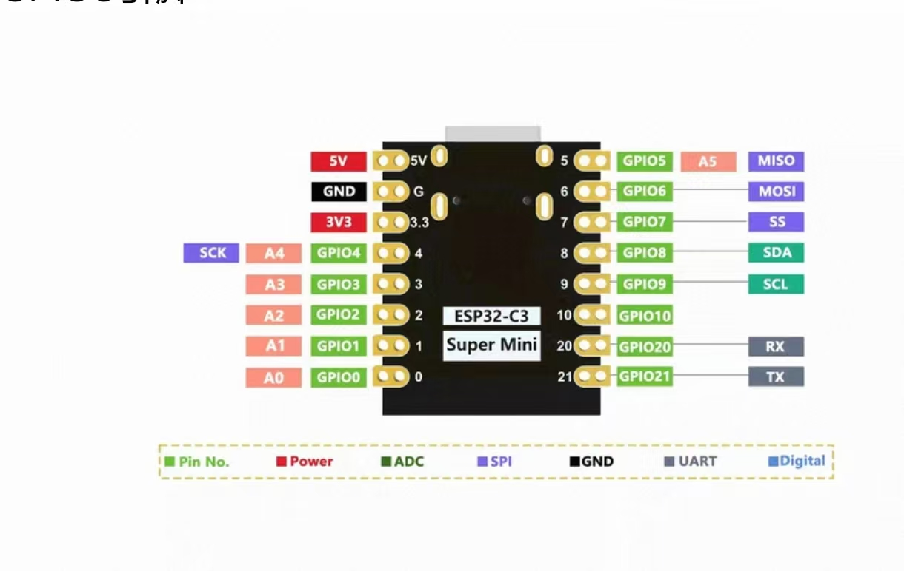

# KKar 智能桌面伴侣

<p align="center">
  
</p>

基于 ESP32-C3 Super Mini 的智能桌面伴侣，拥有可爱的表情显示、时钟功能和触摸交互。

## ✨ 功能特点

- 🎭 **表情显示** - 可爱的眨眼动画，多种表情状态
- ⏰ **时钟模式** - NTP 自动同步，显示日期时间
- 📊 **系统信息** - 显示 WiFi 状态、内存使用等
- 👆 **触摸交互** - 短按切换模式，长按进入设置
- 📶 **WiFi 配网** - 首次使用自动进入 AP 配网模式
- 💾 **配置持久化** - 自动保存用户设置
- 😴 **屏幕保护** - 自动调暗和睡眠，节省功耗

## 🔧 硬件清单

| 组件 | 型号 | 数量 |
|------|------|------|
| 主控板 | ESP32-C3 Super Mini | 1 |
| 显示屏 | 0.96寸 OLED (SSD1315, I2C) | 1 |
| 触摸传感器 | TTP223 | 1 |

## 📌 接线说明

| 组件 | 引脚 | ESP32-C3 |
|------|------|----------|
| OLED | VCC | 3.3V |
| OLED | GND | GND |
| OLED | SDA | GPIO8 |
| OLED | SCL | GPIO9 |
| TTP223 | VCC | 3.3V |
| TTP223 | GND | GND |
| TTP223 | OUT | GPIO2 |

## 🚀 快速开始

### 方式一：Web 在线烧录（推荐）

无需安装任何软件，使用 Chrome/Edge 浏览器直接烧录：

1. 打开 [KKar Web 烧录工具](kkar-flasher/index.html)
2. 用 USB 线连接开发板
3. 点击「连接并烧录」
4. 等待完成即可

### 方式二：PlatformIO 编译烧录

```bash
# 克隆项目
git clone https://github.com/qielantingyu2026/ESP32.git
cd ESP32

# 编译
python -m platformio run -e esp32c3

# 烧录
python -m platformio run -e esp32c3 -t upload
```

## 📖 使用说明

### 首次使用

1. 上电后自动进入 AP 配网模式
2. 手机连接 WiFi：`KKar-XXXXXX`
3. 浏览器打开 `192.168.4.1` 配置 WiFi
4. 连接成功后自动同步时间

### 触摸操作

| 操作 | 功能 |
|------|------|
| 短按 | 切换显示模式（表情 → 时钟 → 系统信息） |
| 长按 (2秒) | 进入设置 / 唤醒屏幕 |
| 超长按 (10秒) | 恢复出厂设置 |

### 显示模式

- **表情模式** - 显示可爱表情，随机眨眼动画
- **时钟模式** - 显示当前时间和日期
- **系统信息** - 显示 WiFi、IP、内存等信息

## 📁 项目结构

```
ESP32/
├── src/                    # 源代码
│   ├── main.cpp           # 主程序
│   ├── DisplayManager.cpp # 显示管理
│   ├── FaceRenderer.cpp   # 表情渲染
│   ├── ClockRenderer.cpp  # 时钟渲染
│   ├── TouchManager.cpp   # 触摸管理
│   ├── WiFiMgr.cpp        # WiFi管理
│   └── ...
├── include/               # 头文件
│   └── config.h          # 硬件配置
├── kkar-flasher/         # Web烧录工具
│   ├── index.html        # 烧录页面
│   └── firmware/         # 固件文件
└── platformio.ini        # PlatformIO配置
```

## 🛠️ 开发环境

- PlatformIO IDE
- ESP32 Arduino Framework
- 依赖库：
  - U8g2 (OLED驱动)
  - WiFiManager (配网)
  - NTPClient (时间同步)

## 📄 许可证

MIT License

## 🙏 致谢

- [U8g2](https://github.com/olikraus/u8g2) - 强大的单色显示库
- [WiFiManager](https://github.com/tzapu/WiFiManager) - 便捷的 WiFi 配网库
- [ESP Web Tools](https://esphome.github.io/esp-web-tools/) - Web 烧录工具
